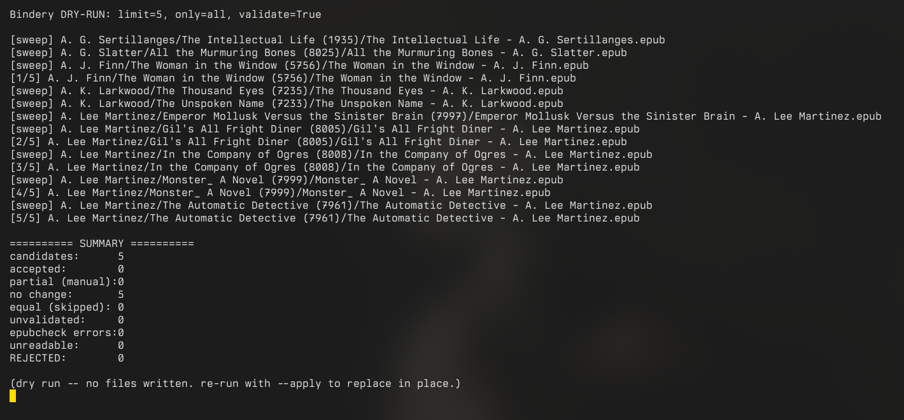

<div align="center">
  
  <h1>Bindery</h1>
  <p>Audit EPUB body text and repair broken EPUBs with safe, deterministic fixes, validated by epubcheck, with optional in-place replacement in a Calibre library.</p>
</div>

<p align="center">
  
</p>

## What it fixes

Bindery makes accidentally broken markup well-formed again. It does not rewrite or reflow content. The **default pass** applies only a small set of deterministic, semantics-preserving well-formedness fixes that real-world EPUBs (especially Calibre conversions) trip over — nothing else changes without an explicit flag:

- **Unclosed void elements** (`<link>`, `<br>`, ``, ...) get self-closed.
- **Undeclared named entities** (`&nbsp;`, `&deg;`, `&eacute;`, ...) become numeric character references that every XML parser understands.
- **Bare `&`** (common in `toc.ncx`) is escaped to `&amp;`.
- **Junk before the XML prolog** (BOM, stray bytes) is stripped.
- **Duplicate `xmlns`** on the root `<html>` is collapsed to one.
- **NCX-001**: `toc.ncx` `dtb:uid` is synced to the OPF unique identifier; duplicated NCX `playOrder` values are resequenced whenever the NCX is processed (part of the always-on NCX pipeline, not a flag).
- **mimetype** is rewritten first and stored, fixing the common ordering defect; a missing entry is added and wrong or whitespace-padded content is normalized to the OCF constant.

### Opt-in repairs

Everything below is off until its flag is passed (or all at once via `--all`). They go further than well-formedness — altering structure or adding minimal content — so they never run by default:

- **`--fix-ids`**: rewrite ids that are not valid XML names (start with a digit, contain a colon) in the OPF manifest, updating every reference to them (spine, fallback, media-overlay, the EPUB 2 cover meta), and in the NCX (where old conversions stamp navPoint ids from UUIDs). Touches the OPF, so it is off by default; the dc: metadata is never altered.
- **`--add-img-alt`**: add `alt=""` to `` elements missing the required attribute. Renders identically, but it adds markup the author never wrote, and an empty alt tells a screen reader the image is decorative; hence opt-in.
- **`--reserialize`**: rebuild content documents that are still malformed by re-parsing them with html5lib and re-emitting XHTML, closing unclosed `<p>`/`<div>`/`<span>`/`<blockquote>` that the regex transforms cannot. Runs only on documents that are not already well-formed, so good files are untouched.
- **`--strip-bad-attrs`**: drop attributes that are invalid XML (a name starting with a digit, or a namespaced name whose prefix is never declared, like Office VML `v:shapes`). Surgical and a no-op on well-formed files.
- **`--escape-unknown-entities`**: escape entity names that are not in the HTML5 table (`&foo;` becomes `&amp;foo;`), which renders exactly as browsers already render an unknown entity. Documents whose DOCTYPE carries an internal subset are skipped wholesale, since a subset can declare custom entities.
- **`--fix-id-colons`**: translates illegal colons in `id="X:Y"` and their matching `#X:Y` fragment references to valid underscores.
- **`--fix-empty-body`**: appends a non-breaking space `&nbsp;` to strictly empty body tags to satisfy parser requirements.
- **`--fix-missing-title`**: injects a `<title>Unknown</title>` fallback in the `<head>` if missing, handling both empty `<title/>` self-closing tags and entirely absent tags.
- **`--unwrap-block-in-inline`**: safely unwraps `<span>` tags that illegally contain a block-level element (e.g. `<div>` or `<p>`), leaving the block element intact.
- **`--strip-invalid-value`**: systematically strips invalid `value="..."` attributes from elements like `<div>`, `<span>`, `<p>`, etc.
- **`--unwrap-illegal-tags`**: strips completely invalid or deprecated HTML tags that break EPUB3 validation (`<st>`, `<sentence>`, `<o>`, `<w>`, `<pagebreak>`) while retaining their inner text. Any of those names styled as an *element selector* by an EPUB stylesheet (`.css` entries and inline `<style>` blocks alike; class/id selectors like `.st`/`#w` don't count) is protected for the whole book, guaranteeing format preservation.


Three opt-in fixes are **lossy** and stand apart from the semantics-preserving rest:

- **`--strip-pagination`**: remove print page numbers and running headers that a PDF/OCR conversion baked into the body text as literal paragraphs (so they reflow into the middle of a sentence: "where the hay cart **16** was taking him"). It removes only that injected furniture, never the author's prose: where a number split a sentence it rejoins the two paragraphs (closing up a word split like `compli-` / `mentary`), and it preserves roman chapter numbers, page-list nav anchors, and years. A book is only treated as paginated when it has both a dense run of arabic numbers and several confident mid-sentence interrupts, so a merely chapter-numbered book is left alone. Three safety nets guard every edit (character conservation, tag balance, and an epubcheck no-regression check); any failure leaves the document untouched.
- **`--strip-broken-tags`**: remove leaked HTML closing tags missing their open brackets (e.g. `</p>`) that render as raw text.
- **`--strip-watermarks`**: remove known producer and distributor watermarks (e.g. OceanofPDF, ABC Amber LIT Converter) and stray marker files. It locates the stamp and deletes the outermost wrapper whose entire visible text is the watermark, ensuring prose that merely mentions the URL is preserved.

All lossy edits are invisible to epubcheck, so they are accepted when the result is *no worse* rather than measurably better.

## The safety contract

Every repair is gated by [epubcheck](https://github.com/w3c/epubcheck). The acceptance rule is two-mode, because a fatal parse error makes epubcheck stop reading a file and hides every downstream error:

- If a book **had fatals**, success means **fewer fatals**. The error count may rise as previously-hidden schema warnings become visible once the file parses; that is the book going from "won't open" to "opens with nits," not a regression.
- If a book had **no fatals**, an error increase is a real regression, so a strict error decrease is required.

Introducing a net-new fatal is always rejected. If epubcheck itself fails to run (crash, timeout, unparsable output), the book is reported as an error and never applied; only an explicit `--no-validate` skips the gate. Originals are never modified except by an explicit, atomic in-place replace (see below), and even then only after the gate accepts the result.

The lossy modes (`--strip-pagination`, `--strip-broken-tags`, and `--strip-watermarks`) are the exception to the "must improve" rule. Since they remove visible markup rather than correcting XML schema violations, epubcheck counts often remain unchanged. They are accepted when the result is **no worse** (no net-new fatals or errors), relying on strict programmatic safety nets instead.

## Install

Python 3.14+, plus epubcheck on `PATH` for the gate. Dependencies: `tqdm` for progress output, plus the pinned VirInvictus libraries `vir-tui` (TUI rendering) and `cquarry` (read-only Calibre database access); `html5lib` remains an optional extra, needed only for `--reserialize`.

```sh
uv tool install /path/to/Bindery                    # core tools
uv tool install "bindery[reserialize] @ /path/to/Bindery"   # incl. --reserialize
# or from a checkout:
PYTHONPATH=src python3 -m bindery --help          # all modes except --reserialize
PYTHONPATH=src uv run --with html5lib python3 -m bindery --help   # incl. --reserialize
```

## Usage

Three verbs: `bindery repair` fixes a single EPUB epubcheck-gated, `bindery audit`
reports content flaws without touching anything, and `bindery library` sweeps a Calibre
library tree (dry run by default; `--apply` replaces accepted books atomically in place).
The sections below take each in turn.

## Auditing

Bindery includes a comprehensive auditing tool to inspect EPUB body text for non-schema flaws that epubcheck cannot catch. It extracts and analyzes the visible text to detect content issues, producing console reports that can be used to filter your library or feed into `bindery repair`.

Scan a Calibre library for specific issues:

```sh
# Detect non-English content (e.g., Cyrillic or CJK in an English library)
cd ~/docs/Calibre\ Library && bindery audit content

# Find books with hardcoded print page numbers interrupting the text
bindery audit pagenumbers ~/docs/Calibre\ Library

# Find books that are empty or severely truncated
bindery audit emptytext ~/docs/Calibre\ Library

# Find books with severe OCR damage (garbage characters, excessive hyphenation)
bindery audit ocr ~/docs/Calibre\ Library

# Run all audits and generate a comprehensive CSV
cd ~/docs/Calibre\ Library && bindery audit all
```

Audits can also be run on a directory of loose `.epub` files by passing the path as the second argument:
```sh
bindery audit pagenumbers /path/to/loose/epubs
```

Or on one or more library books by Calibre id (comma-separated) — fetched through cquarry's single-entity `get_book()` (no library-wide scan), with the EPUB resolved via cquarry's own path logic:
```sh
cd ~/docs/Calibre\ Library && bindery audit all --id 1234,1235
```
`--id` composes with `--tag`: the book is tagged only if the audit flags it.

**Spine-integrity reporting:** Both `audit` and `library` reports now classify manifest/NCX references that point to absent files. A `convention` verdict means the ToC is bloated but the present documents form a consecutive chapter span (e.g., the Wandering Inn official-build pattern, safe). A `fragment` verdict means the span itself is broken.

### Tagging flagged books (opt-in)

By default an audit writes nothing. With `--tag TAG` (library mode only), every book the audit
flags is tagged in `metadata.db` through cquarry's trigger-safe write module — useful for piping
flagged books back into Calibre views:

```sh
cd ~/docs/Calibre\ Library && bindery audit content --tag "Audit Flagged"
```

The audit itself stays read-only; only the final tagging pass writes, it skips books that already
carry the tag, and THIN emptytext advisories are never tagged. Close Calibre first so the write
does not fight its lock. Tagged books are recorded in Calibre's `metadata_dirtied` queue, so the
desktop app regenerates their sidecar `.opf`s (and re-pushes metadata to wireless readers) on its
next startup — no manual resync needed.


Repair one book to a new file (gated; writes only if it is an improvement):

```sh
bindery repair broken.epub                 # -> "broken (repaired).epub"
bindery repair broken.epub fixed.epub
bindery repair scanned.epub --strip-pagination   # also remove baked-in page numbers
```

Scan a Calibre library and see what would be fixed, writing nothing:

```sh
bindery library ~/docs/Calibre\ Library --only fatals --audit epub_audit.csv
```

Apply accepted repairs in place, atomically, with backups:

```sh
bindery library ~/docs/Calibre\ Library --only fatals --apply --backup ~/bindery-backups
```

Apply all safe and lossy repairs directly into the Calibre database natively:

```sh
bindery library ~/docs/Calibre\ Library --only all --apply --all --install-to-calibre
```

- `--only {fatals,ncx,all}` restricts the candidate set. `ncx` targets NCX-001 mismatches (detected without epubcheck); `fatals` needs `--audit`.
- `--id <ids>` limits the sweep to a comma-separated list of Calibre book IDs, skipping the full library walk.
- `--audit CSV` (the `fatals,errors,warnings,path` format produced by an epubcheck sweep) skips clean books so a run is fast. Paths are resolved on both sides, and a CSV that matches nothing triggers a loud warning instead of silently selecting zero books.
- `--sweep` replaces the CSV step entirely: it runs a live epubcheck sweep for candidate selection and reuses each result as that book's before-measurement, so no book is checked twice. Bindery launches a transparent, persistent Java daemon (`EpubcheckDaemon`) to evaluate candidates in the background, eliminating the JVM startup penalty. This reduces validation time from ~5 seconds per book down to ~0.05 seconds, allowing `--sweep` to scan a 5,000-book library in just 10 minutes. Combine with `--only fatals` for a self-contained, lightning-fast "find and fix the broken books" run.
- `--json FILE` writes a machine-readable report of the whole run (per-book status, before/after counts, applied flag, summary totals). `--manual-list FILE` writes the paths of every book that was not auto-repaired, one per line, ready for manual follow-up.
- `--apply` is required to write; the default is a dry run. `--backup DIR` mirrors originals before replacing; `--backup-inplace` writes `.epub.bak` beside each file.
- `--install-to-calibre` resolves the Calibre book id from `metadata.db` via cquarry (one read-only path→id map per run), so a hand-renamed `Author/Title (id)/` directory can never send the repaired file to the wrong book. The directory-name regex is only a no-catalog fallback; with neither, the file is saved atomically in place.
- `--install-to-calibre` acts as a safer alternative to atomic replacement for Calibre libraries. It uses `calibredb add_format --replace` to natively swap the EPUB format without losing metadata or read progress. It falls back to atomic file replacement if the Calibre database ID cannot be parsed.
- `--all` automatically turns on all opt-in non-fatal fixes and lossy strips (pagination, watermarks, bad attributes, unknown entities, image alt tags, etc.) in a single run.
- Only the `.epub` is replaced. `metadata.opf`, `cover.jpg`, and `metadata.db` are left for Calibre's Quality Check sync to reconcile.
- A per-book progress line goes to stderr (stdout stays a clean report); `--quiet` suppresses it. A corrupt or unreadable book is reported and skipped, never aborting the sweep.
- Exit codes: 0 for a clean sweep, 1 for a usage error, 2 when any book was rejected, unreadable, or failed epubcheck (for scripts and cron).
- `repair` refuses to overwrite an existing output file unless `--force` is given.

## Companion scripts

`scripts/` holds standalone, read-only utilities that are useful for EPUB maintenance but fall outside Bindery's repair contract (fixing what they find would be a content change, which Bindery makes only via the opt-in `--strip-pagination`):

- `find_missing_images.py`: scans a library tree and reports every book whose `` tags point at files that do not exist inside the archive (a common defect in converted EPUBs). Reads the archives in place; nothing is unpacked or written. The library path is set at the bottom of the script.

## Development

```sh
./run_tests.sh        # unittest suite
```

See [spec.md](spec.md) for the full contract and [roadmap.md](roadmap.md) for what is planned.

## License

MIT. See [LICENSE](LICENSE).

## Support

If Bindery's useful to you and you'd like to chip in:

- liberapay · [liberapay.com/bdkl](https://liberapay.com/bdkl/)
- bitcoin
  ```
  bc1qkge6zr45tzqfwfmvma2ylumt6mg7wlwmhr05yv
  ```
